# Kanban Action Planner

An Obsidian plugin that adds a **Kanban board view to [Obsidian Bases](https://help.obsidian.md/bases)**, so any set of notes can be planned, tracked, and scheduled visually.

A status property you define becomes the columns. You drag cards between them, reorder them, color them, view and edit the relationships between notes, surface what's blocked, filter as you type, and flip the same board into a calendar to schedule the work. Everything is driven by your existing note properties, and every change is written straight back to your frontmatter. Define your note types yourself, or let the [Obsidian Starter Kit](https://store.dsebastien.net/) plugin configure them for you when it's installed.

> Requires Obsidian 1.12+ (the Bases view API). Desktop only (mobile isn't supported yet).

## Screenshots

A Base read as a board. A configurable status property drives the columns, and each card shows the properties from your Bases view:

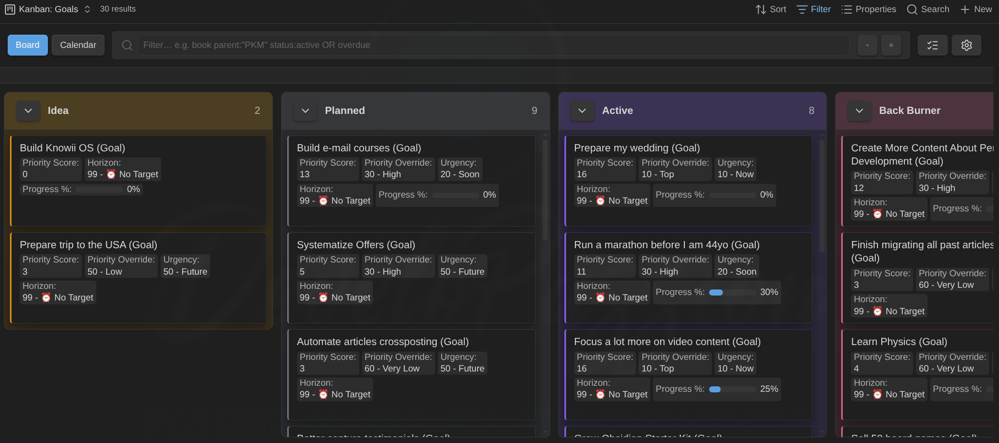

The same idea on a large task base, with collapsed columns keeping the backlog out of the way:

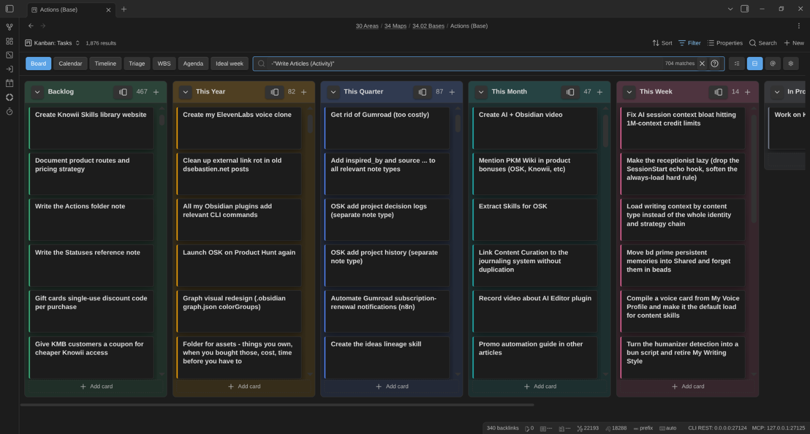

Split the board into swimlanes by note type or any property (here, by priority):

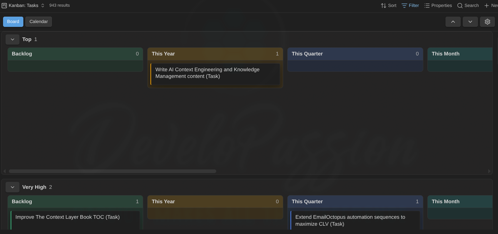

Flip that exact board into a calendar to schedule work, plotting scheduled dates and deadlines together:

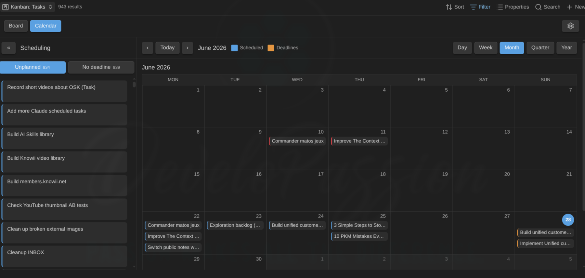

Or into a Gantt-style timeline that places each card by its start date and estimate, with cards grouped by note type and status in the Unplanned panel:

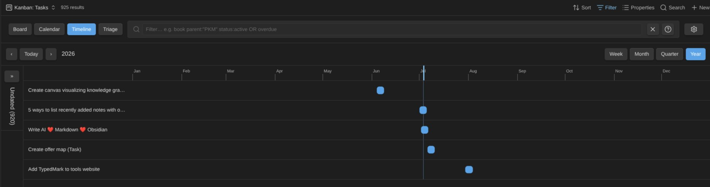

Break the same work down as a WBS tree, with estimates, progress, and dates rolling up the hierarchy (own values win, the rest derives from the children):

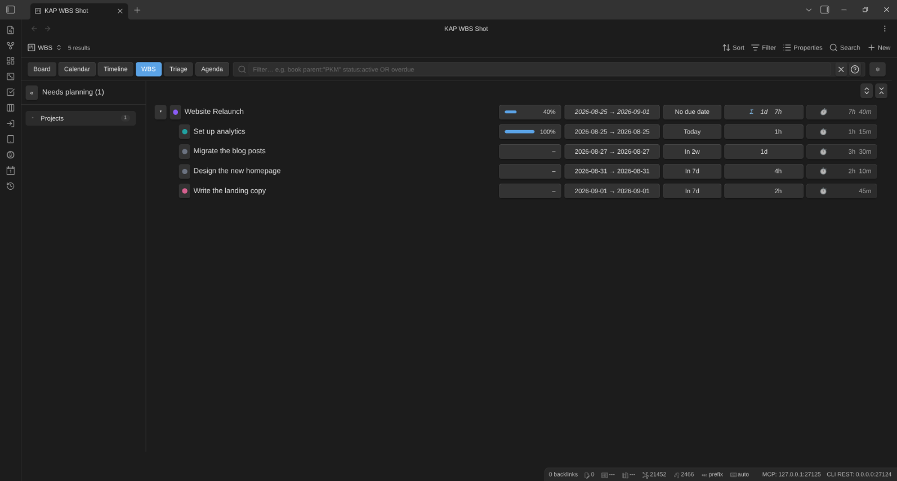

Filter as you type with a compact query language:

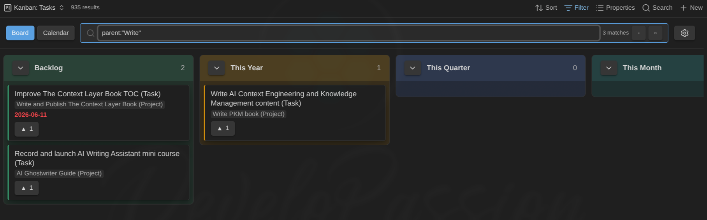

Slice any view by GTD contexts (`@work`, `@home`, …) from the toolbar **@** switcher:

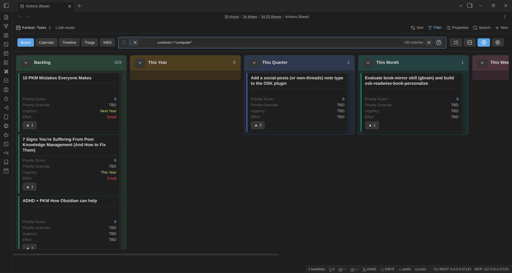

When a backlog gets overwhelming, work through it one card at a time in Triage mode:

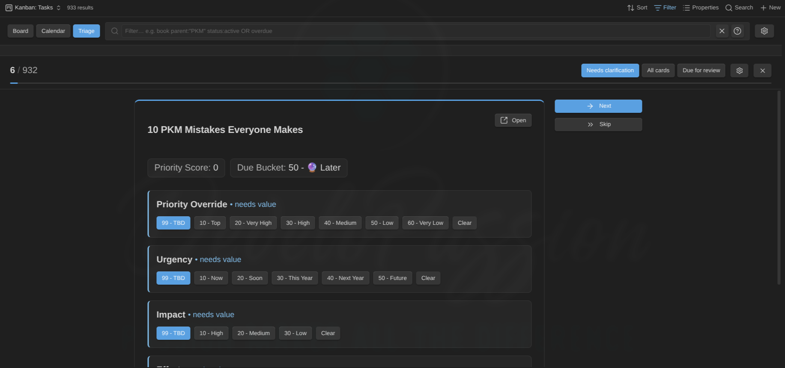

Embed the same view in any note, several times in different modes — here a board and its calendar, both pinned to one project via `![[Tasks.base#Kanban|mode=board filter=parent:"Obsidian Starter Kit (Project)"]]` and `|mode=calendar …`:

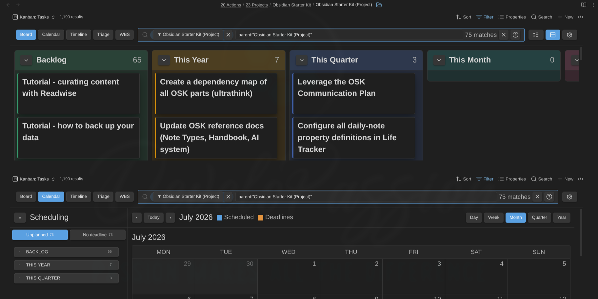

Let the board do the bookkeeping with per-note-type automation rules — enter a done state and the progress, dates, tags, or even the note's folder update themselves:

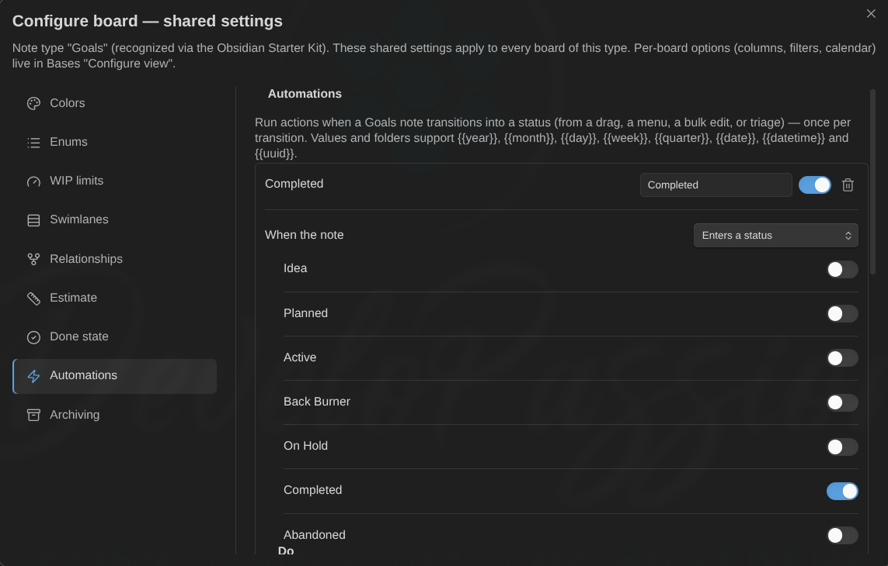

Configure statuses, colors, relationships, and archiving per note type, synced from the Obsidian Starter Kit when it's present:

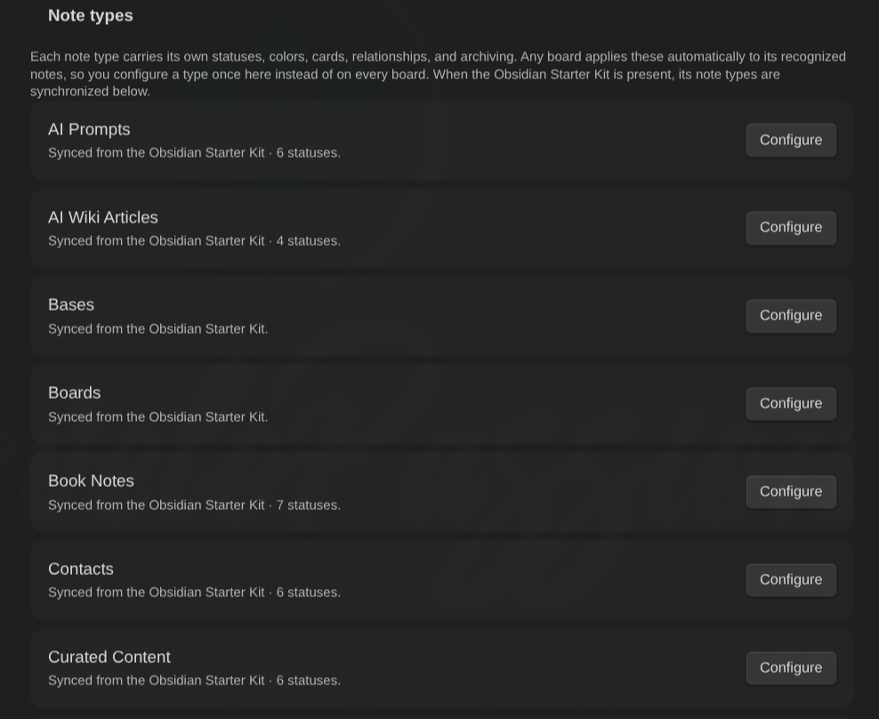

## Install

**From Community plugins** (once listed): go to **Settings → Community plugins → Browse**, search for **Kanban Action Planner**, install, and enable.

**Manually:** download `main.js`, `manifest.json`, and `styles.css` from the [latest release](https://github.com/dsebastien/obsidian-kanban-action-planner/releases) into `<vault>/.obsidian/plugins/kanban-action-planner/`, then enable the plugin in **Settings → Community plugins**.

Then add a **Kanban** view to any [Base](https://help.obsidian.md/bases). See the [usage guide](./docs/usage.md) for the full walkthrough.

## Highlights

- **Kanban view in Bases.** Add one or more Kanban views to any Base. The Base's own filters select the notes.
- **Embed a board in any note.** `![[Tasks.base#Kanban]]` renders the view inside a markdown note, sized to its content up to a scrollable height cap. The wikilink alias overrides that one embed — `|mode=wbs height=400 filter=status:active` — without ever touching the saved view: mode switches and filter edits inside an embed stay in the embed.
- **Status to columns, defined not guessed.** A configurable status property places cards into columns you define (per view, from the Starter Kit, or in settings), so a typo can't create a stray column. Unmapped notes collect in an "Unmapped" column that hides itself when empty.
- **Move, reorder, sort.** Drag a card to another column to change its status, or reorder within a column (written to a configurable `manual_order` property). Send a card straight to the top or bottom of its column from the right-click menu. Auto-sort each column by name or any property, including a base formula like a `priority_score`, ascending or descending. Full keyboard support (move, reorder, menu) and command-palette commands.
- **Filter as you type.** A toolbar search box with a compact, Jira-like query (`status:active OR due:overdue`, `parent:"PKM" -tag:archived`), saved per view, in both board and calendar mode.
- **GTD contexts.** Tag notes with contexts (`@work`, `@home`, …) in a `contexts` list property and filter to any combination from a toolbar **@** switcher (or pin one in an embed with `context=`). Toggle a card's contexts from its right-click menu, and see them color-coded on the calendar and timeline with a click-to-filter legend.
- **Triage mode.** Work through an overwhelming backlog one card at a time, setting priority, urgency, effort, and the rest from one-click controls. It doubles as a spaced-repetition review queue, surfacing cards whose review is overdue.
- **Relationships, viewable and editable.** Parent, sibling, child, and `blocked_by` via link-properties (plus an optional tag and link heuristic). Navigate them, add or remove them from the card menu, flag and filter blocked items. An archived blocker stops blocking.
- **Focus on a card's children or whole subtree.** Zoom into a project (card menu or the ▼ children badge) and the board re-filters to just its children — or all its descendants — in the usual columns. Zoom up from a task via its ▲ parents badge to see the whole project's children (or a goal's entire subtree) at once. A dismissible chip next to the filter box shows the focus; zooming again drills down a level.
- **Swimlanes.** Split the board into collapsible lanes by note type or any property, with an Ungrouped lane. Cross-lane drag rewrites the grouping property. A board mixing note types auto-groups by type, and **each type's lane gets its own columns, colors, and WIP limits** — a card's own note type is authoritative for its status, so a project can never be given a task status.
- **Calendar mode.** Flip a board into a scheduling calendar (day, week, month, quarter, year) that plots scheduled dates and deadlines together. Drag cards onto days to set `date_scheduled` or `date_due`, with an Unplanned / No-deadline panel and per-day zoom. In every scheduling panel (calendar, timeline, WBS), drag a card onto another status group to change its status in place. Cards with an estimate span every covered day (dimmed continuation chips).
- **Timeline mode.** A Gantt-style view placing each card by **start date + estimate** (no end date; days by default, or a per-note-type property/unit override — e.g. tasknotes-style `time_estimate` minutes, converted via a configurable minutes-per-day): a square without an estimate, a rectangle spanning it with a duration badge (`5d`). Drag to move the start, resize the right edge to change the estimate, the left edge to shift the start (end stays anchored) — with the to-be-written date shown live on every drag, resize, and drop. Milestone diamonds, a today line, a per-row red deadline line, Week/Month/Quarter/Year axis with Ctrl/Cmd+wheel zoom, a collapsible "Unplanned" side panel of cards grouped by note type and status, and per-type show/hide on mixed boards.
- **WBS mode.** A work-breakdown-structure view rendering your parent/child hierarchy as a collapsible tree — goal → projects → tasks — with per-node progress bars, estimates, due-date countdowns, and date spans. One rollup model: a note's own value wins, otherwise it derives from its children — so you can plan top-down, bottom-up, or both, and persist any rollup to the parent in one click (never double-counted). Give a note type a **done state** (a property + the value(s) that mean done, e.g. the Completed/Done statuses) and done notes count as 100% in the rollup — a goal with 2 of 4 tasks done shows 50% without any progress numbers. Siblings with planned dates order themselves chronologically. Works on any view: notes without relationships show as standalone rows, and parents excluded by the view's filters (a tasks-only view whose tasks belong to projects) appear as muted “outside view” context rows so the hierarchy keeps its shape. Drag rows to re-parent or onto the panel to detach (the relationship wikilink is rewritten for you), drag cards from the "Needs planning" backlog into the tree, set status/dates/estimates/progress from any row (click the status dot for a quick status menu; the estimate chip edits inline — type `3`, `2h`, or `0.5d` and press Enter), and distribute a parent's estimate across unestimated children.
- **Archiving.** Move finished cards into a placeholder-driven folder (`Archive/{{year}}` and more), manually or automatically when a card reaches a given status. Links are preserved.
- **Automation rules.** Per note type: "when a note enters (or leaves) a status, enters a done state, is archived, or a property crosses a condition (`progress ≥ 100`…) — do things": set or remove properties (values take `{{date}}`-style placeholders), add or remove tags, move the note to a placeholder-driven folder. Mark a task Done and its progress jumps to 100, the due date clears, and `date_completed` stamps itself — from any write path (drag, menu, bulk, triage), exactly once per transition, with no cascading rules.
- **Cards show your view's properties.** Each card renders the properties you've added to the Bases view (the standard **Properties** selection), labelled and in order. Ordinary properties and base formulas (`formula.…`) alike, so a computed value shows with no extra setup. Enum values are color-coded by rank (warm = top priority or urgency, cool = low) so the board reads like a heatmap, the `NN -` sort prefix is hidden, and a numeric score shows as an accent badge. The card title can come from any property instead of the note name (per view, with the note name as fallback) — handy when filenames are IDs or dated slugs.
- **Note types.** Reusable per-type config (statuses, colors, relationships, archiving, swimlanes). Define your own by tag, folder, or regex, or mirror them from the Obsidian Starter Kit when present.
- **Productivity touches.** Soft per-column WIP limits, multi-select with bulk set-status / archive / open, a compact mode showing titles only, overdue and due-today emphasis, an optional due countdown badge (`In 3d`, `2d overdue`, `Today`, color-coded by urgency and positionable on the title, a chip, the corner, or a footer), native hover preview, and per-view state remembered across reloads.
- **What's new after updates.** After a plugin update, a one-time dialog shows the release notes you just received (including any versions you skipped) with ways to support development. It never appears on fresh installs or regular restarts.
- **Your notes stay the source of truth.** Status, order, dates, relationships, and grouping are all written to frontmatter. Desktop only for now (mobile isn't supported yet), and respects reduced-motion settings.

## Development

See [DEVELOPMENT.md](./DEVELOPMENT.md). In short: `bun install`, then `bun run dev` (watch) or `bun run build` (production). Quality gate: `bun run tsc`, `bun run lint`, `bun test`, `bun run build`.

## License

MIT License. See [LICENSE](./LICENSE).

<!-- other-plugins:start -->

## My other Obsidian plugins

| Plugin                                                                                                        | What it does                                                                                                                                  |
| ------------------------------------------------------------------------------------------------------------- | --------------------------------------------------------------------------------------------------------------------------------------------- |
| [Agentic Resource Discovery Server](https://github.com/dsebastien/obsidian-agentic-resource-discovery-server) | Local-first Agentic Resource Discovery publisher and registry that serves your AI skills and tools to agents over a local HTTP and MCP server |
| [Book Exporter](https://github.com/dsebastien/obsidian-book-exporter)                                         | Export books (one manifest note + linked chapter notes) to EPUB and PDF via Pandoc                                                            |
| [Bookshelf Base](https://github.com/dsebastien/obsidian-bookshelf)                                            | Display your notes as a visual bookshelf via a custom Bases view                                                                              |
| [Dataview Serializer](https://github.com/dsebastien/obsidian-dataview-serializer)                             | Serialize Dataview queries to Markdown, and keep the Markdown representation up to date                                                       |
| [Expander](https://github.com/dsebastien/obsidian-expander)                                                   | Replace variables across your vault using HTML comment markers. Supports static values and dynamic functions                                  |
| [Ghost Publish](https://github.com/dsebastien/obsidian-ghost-publish)                                         | Publish your vault notes to a Ghost blog with configurable presets for tags, newsletters, and frontmatter conventions                         |
| [Graph Explorer Base View](https://github.com/dsebastien/obsidian-graph-explorer-base-view)                   | A custom Bases view that renders notes as an interactive force-directed graph with explored/unexplored tracking                               |
| [Hidden Folders Access](https://github.com/dsebastien/obsidian-hidden-folders-access)                         | Index hidden root-level folders (e.g. .claude) so they appear in the file tree, metadata cache, and Bases                                     |
| [Journal Bases](https://github.com/dsebastien/obsidian-journal-base)                                          | Custom Base views for journaling and periodic reviews                                                                                         |
| [Life Tracker](https://github.com/dsebastien/obsidian-life-tracker-base-view)                                 | Capture and visualize the data that matters in your life                                                                                      |
| [Note Village](https://github.com/dsebastien/obsidian-note-village)                                           | A 2D pixel art village where your notes become villagers you can explore and chat with using AI                                               |
| [Obsidian Starter Kit](https://github.com/DeveloPassion/obsidian-starter-kit-plugin)                          | Adds strong typing support and powerful automation support for notes                                                                          |
| [Remarkable Synchronizer](https://github.com/dsebastien/obsidian-remarkable-sync)                             | Connect to the reMarkable cloud, list, download, and sync notebook pages as images                                                            |
| [Replicate](https://github.com/dsebastien/obsidian-replicate)                                                 | Use AI models with ease via the Replicate.com integration                                                                                     |
| [REST and MCP server](https://github.com/dsebastien/obsidian-cli-rest)                                        | Exposes CLI commands as RESTful API endpoints and an MCP server for AI tool integration                                                       |
| [Time Machine](https://github.com/dsebastien/obsidian-time-machine)                                           | Browse, compare, and restore previous versions of your notes using built-in file-recovery snapshots                                           |
| [Transcriber](https://github.com/dsebastien/obsidian-transcriber)                                             | Transcribe images to markdown using Ollama vision models                                                                                      |
| [Typefully](https://github.com/dsebastien/obsidian-typefully)                                                 | Publish social media posts with ease using the Typefully integration                                                                          |
| [Update Time](https://github.com/dsebastien/obsidian-update-time)                                             | Automatically update front matter to include creation and last update times                                                                   |

Everything I build is documented in [my newsletter](https://dsebastien.net/newsletter) and on [my YouTube channel](https://youtube.com/@dsebastien).

<!-- other-plugins:end -->

<!-- support-cta -->

## News & support

To stay up to date about this plugin, Obsidian in general, Personal Knowledge Management and note-taking:

- Subscribe to [my newsletter](https://dsebastien.net/newsletter)
- Subscribe to [my YouTube channel](https://youtube.com/@dsebastien)
- Join the [Knowii community](https://www.store.dsebastien.net/product/knowii-community/) and learn to organize your notes and put your knowledge to work, together with fellow knowledge workers

If this plugin is useful to you, here are the best ways to support my work ❤️:

- [Join the Knowii community](https://www.store.dsebastien.net/product/knowii-community/)
- [Become a GitHub Sponsor](https://github.com/sponsors/dsebastien)
- [Buy me a coffee](https://www.buymeacoffee.com/dsebastien)
- [Subscribe to my YouTube channel](https://youtube.com/@dsebastien)
- [Check out my products](https://store.dsebastien.net)

Found a bug or have an idea? [Open an issue](https://github.com/dsebastien/obsidian-kanban-action-planner/issues).
